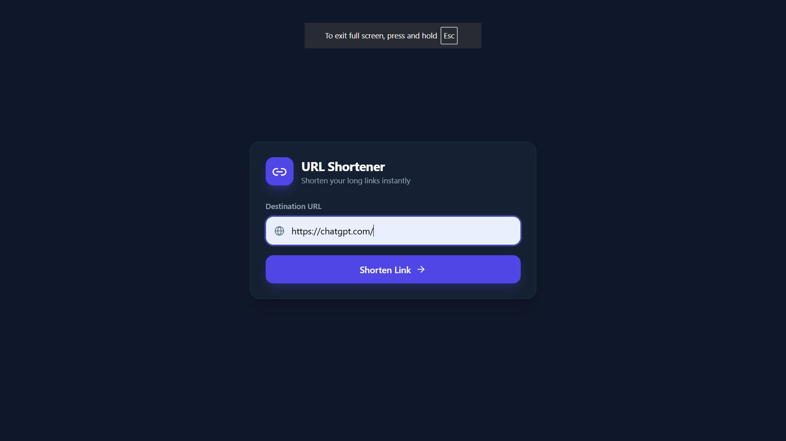
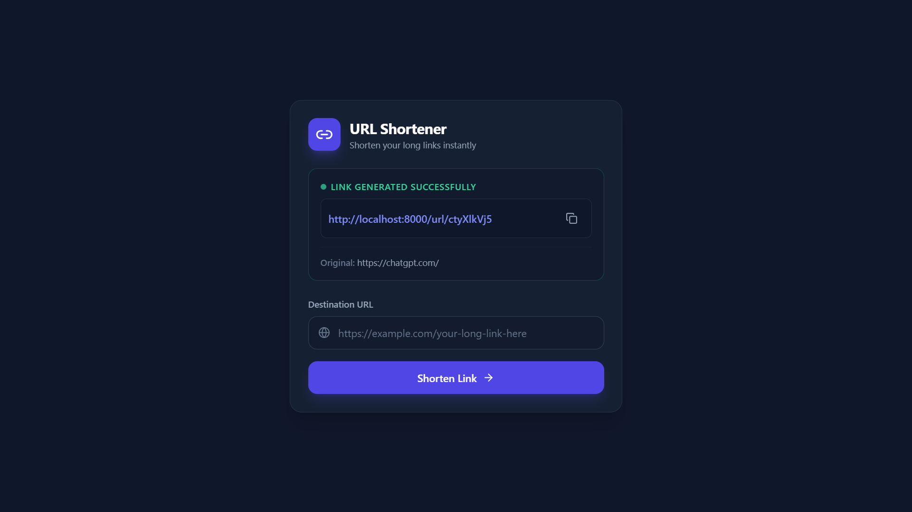

# URL Shortener

A simple Node.js URL shortener built with Express, MongoDB, and EJS.

## Features

- Shortens long URLs using `shortid`
- Stores shortened URLs in MongoDB
- Redirects short links to the original destination
- Minimal UI with instant short link generation

## Screenshots

### Home Page



### Shortened URL Result



## Installation

1. Clone or download the repository.
2. Install dependencies:

```bash
npm install
```

3. Start MongoDB locally on `mongodb://localhost:27017`.
4. Run the app:

```bash
npm start
```

## Usage

1. Open the browser at `http://localhost:8000`.
2. Enter the long URL you want to shorten.
3. Submit the form to generate a short link.
4. Use the generated short link to redirect to the original URL.

## Project Structure

- `index.js` - app entrypoint and Express setup
- `controllers/url.js` - URL creation and redirect handlers
- `routes/url.js` - URL-related routes
- `routes/staticRouter.js` - static route for the home page
- `models/url.js` - MongoDB schema for shortened URLs
- `database/connect.js` - MongoDB connection helper
- `views/home.ejs` - user interface template
- `screenshots/` - UI screenshots included in this README

## Notes

- The app listens on port `8000`.
- The short URL route is `http://localhost:8000/url/:id`.
- Make sure MongoDB is running before starting the server.

---

## 👨‍💻 Author

### Abhi Jain

Passionate Full Stack Developer and Data Engineering Enthusiast with experience in building scalable web applications, real-time communication systems, and data-driven solutions.

- 🎓 B.Tech Graduate
- 🎯 PG-Diploma in Big Data Analytics (CDAC DBDA)
- 💻 Skilled in Full Stack Development, Data Engineering, and Cloud Technologies
- 🚀 Interested in Software Development, Data Analytics, Machine Learning, and Big Data Solutions

---

## 📬 Contact

Feel free to reach out for collaborations, job opportunities, or project discussions.

- 📧 Email: abhijainaj2612@gmail.com
- 💼 LinkedIn: https://www.linkedin.com/in/abhi-jain-5758b12b2/
- 🐙 GitHub: https://github.com/abhijainaj2612
- 📍 Location: Madhya Pradesh, India

---
